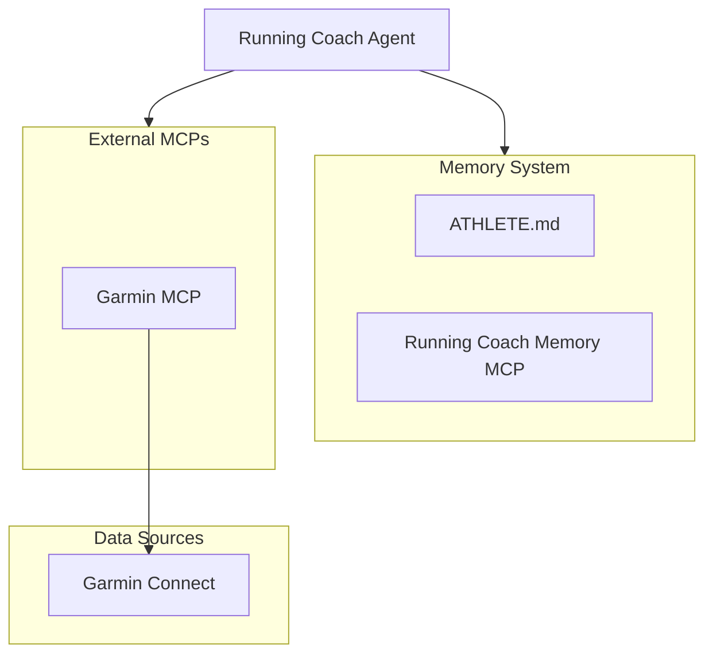

# Running Coach

An AI-powered running coach with persistent memory.

## Overview

Running Coach is an AI agent that acts as a professional running and trail coach. The agent is the "brain" of the system: it analyzes your training data, creates personalized plans, and remembers your conversations over time.



### How It Works

- **Agent**: The orchestrator that makes data-driven decisions about your training.
- **Data Sources**: External platforms that provide real activity data (Garmin Connect today, more platforms coming).
- **Memory System**: Persistent storage for your athlete profile and semantic memory.

## Components

| Component | Description |
|-----------|-------------|
| `agents/running-coach.md` | Agent definition (persona, methodology, tools) |
| `skills/athlete/` | Skill to manage `ATHLETE.md` (athlete profile) |
| `skills/garmin/` | Skill for Garmin Connect integration |
| `skills/running-coach-memory-mcp/` | Skill to interact with the Running Coach Memory MCP |
| `running-coach-memory-mcp/` | MCP server for memory and training plans |

## Running Coach Memory MCP

The Running Coach Memory MCP is the persistent "brain" of the agent. It provides two key capabilities:

- **Plans**: A training calendar that stores past and future workouts. The agent creates workouts here first, then optionally exports them to external platforms.
- **Memories**: Semantic memory that stores insights, preferences, and conversational context. Uses vector embeddings for intelligent retrieval, so the agent can recall relevant past conversations.

This enables the agent to maintain context across sessions and never forget what you've discussed.

## Installation

Follow these steps to set up your Running Coach environment:

### 1. Install Running Coach Memory MCP

This component manages memory and training plans.

1. Navigate to the memory MCP directory:
   ```bash
   cd running-coach-memory-mcp
   ```
2. Install dependencies:
   ```bash
   uv sync
   ```
3. Configure environment variables: Create a `.env` file based on `.env.example` and add your `OPENROUTER_API_KEY`.
4. Add the server to your MCP configuration (in Cursor or Claude):
   ```json
   {
     "mcpServers": {
       "Running Coach Memory": {
         "command": "uv",
         "args": ["run", "--directory", "/path/to/running-coach-memory-mcp", "python", "-m", "memory_mcp.server"],
         "env": {
           "OPENROUTER_API_KEY": "your_api_key_here"
         }
       }
     }
   }
   ```

### 2. Configure Garmin MCP Auth

To sync your Garmin activities, we use the [Garmin MCP by Taxuspt](https://github.com/Taxuspt/garmin_mcp).

1. Authenticate with Garmin Connect by running the following command in your terminal:
   ```bash
   uvx --python 3.12 --from git+https://github.com/Taxuspt/garmin_mcp garmin-mcp-auth
   ```
2. Follow the prompts to enter your email, password, and MFA code if required. This will save your tokens to `~/.garminconnect`.

### 3. Install the Plugin

Set up the agent plugin in your environment:

1. Review the `running-coach-plugin/.mcp.json` file.
2. Adjust the paths and settings in your MCP client if necessary to point correctly to the installed components.

## Quick Start

1. Once the components are installed, create your `ATHLETE.md` profile (the agent will guide you through the onboarding process).
2. Start training! The agent will analyze your data and help you plan your sessions.

## License

MIT
